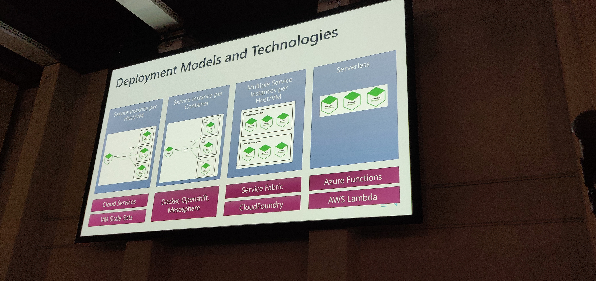
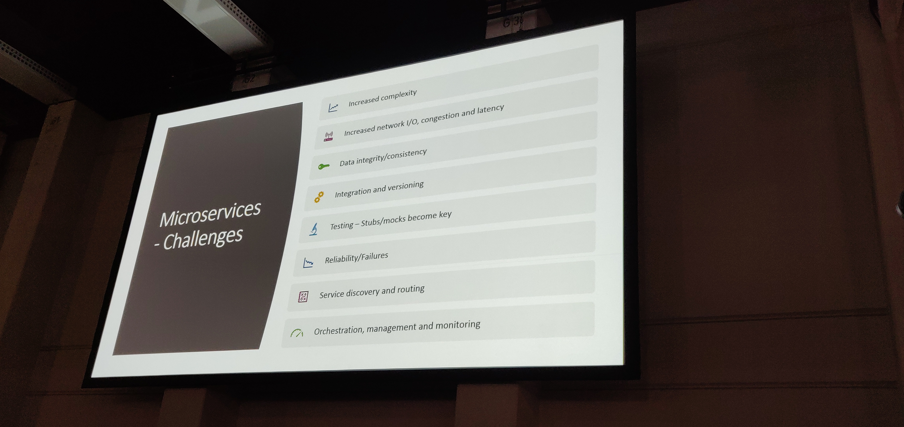

# WeAreDevelopers conference 2019 in Berlin

---

## Thursday

### Congress opening talk

what a fucking opening, now i'm definitely awake

to participate: slido.com #wad2019

### Where Machine Intelligence Ends and Human Creativity Begins

TODO: look up if xkcd re: AI in board games is still accurate

> "Technology is the reason why so many of us are still alive to complain about technology"

Kasparov is a good person

to paraphrase: "Even if we lose jobs to AI, we still improve a lot of lives, and that's what matters"

1. Intelligent tech advances from weak toys to useful tools and eventually to disruptive substitutes.
2. Human + machine means finding better ways to combine, better processes, and virtualization of data.
3. Machines will solve bigger and bigger problems. Humans still ask the same questions and define success.
4. Smarter tools are more powerfull and easier to use, requiring less training and retraining.
5. AI is augmented. We aren't being replaced. We're being promoted.

### Life in The Fast Lane - Don't Get Breached, Embeded Security Into Your Developer Journey

1. Only give the necessary permissions
2. Encourage diversity, aka. code review by multiple people
3. Scan for vulnerabilities early! Reduce attack surface & prioritize critical fixes

### Monitor your data like if it was your code

from [SodaData.io](https://sodatata.io)

> "Software crashed, but Data is just wrong"

seems like they're working on an open-source data monitoring tool, but it doesn't seem to be ready yet

it's supposed to support self-learning of what's regular and what's not, and reporting on that basis

[sodadata on github](https://github.com/sodadata/)

### Brave new world of microservices - patterns, ideas, dos and don'ts

SOA != Microservices

LamaPoll is definitely a monolith

Microservices are an optional structure if a heterogenous structure isn't available to you
(e.g. no developers for your architecture available.)

Microservices are great for:
- splitting up services into separate hardware (e.g. one server for orders, the rest for app)
- separating data sores (e.g. poll from results)
- one service breaking shouldn't break other services

Best practices:
- Don't have client-to-microservice connections, but instead client-to-api-gateway connections
- Don't use synchronous requests between microservices, but use asynchronus SeviceBusses
- Have health check apis
- Be bery cautious when getting data from more than 1 microservice
- "Cloud ready apps" = perfect microservice structure

### When testing makes no sense

basically, think about what you test, and don't be stupid

- keep tests simple
- keep tests focused

### Testing your tests' quality - Introduction to Mutation Testing

[@felix_codes](https://twitter.com/felix_codes) is 17, and a full-stack dev

If code coverage isn't a good measure of test quality, what is?

Mutation testing isn't just testing your code, it's mutation your code to make existing tests fail.

The more tests fail, the better, since mutated tests should fail.

Tyepes of mutants:
- Value (a=12 -> a=15)
- Operator (a > 2 -> a < 2)
- Statement (a++; -> a++;a++;)

Cons of mutation testing:
- giant amount of mutants increases time the tests take
- equivalent mutants (semantic change, but result stays the same) increase test time without being valuable

Tools for mutation testing:
- [pitest for java](pitest.org)
- stryker for js
- inferno for php

### Bridging the integration gap: How to enable service-rich applications faster and with less code

The gist of the talk seems to be:
Use already existing open source projects and stitch them together, that way you don't have to write them yourself.

The entire talk felt like an ad for:
1. you need an integration platform
2. our integration platform is great

### Non-talk notes
- Sentry seems very interesting
    - Platform for error reporting, consolidation, and management
    - Self-hosting is possible

---

## Friday

### Building ethical software

### Company Culture & Diversity

### 25 Years of PHP

### Bulletproof Shoes

### Cyber Hygiene vs. Data Breaches: In a Layman's term

### Improve the quality of your PHPUnit tests with Infection

### data, design, code

### Software Quality without Testing

### Making less of the web with feature policy

### 1+1>2 : impacts of pair programming
